# 專案結構與運作階層整理

本文件整理目前 DE2-115 / Quartus / Qsys / Nios II 專案的硬體與軟體結構，方便後續撰寫報告與繪製方塊圖。本文件不是最終報告，而是工程整理稿，因此會保留較多模組責任、接線、資料流與維護注意事項。

主要依據檔案：`top.v`、`ps2_keyboard_controller.v`、`ps2_receiver.v`、`ps2_scancode_parser.v`、`ps2_ascii_mapper.v`、`keyboard_fifo.v`、`keyboard_pio_interface.v`、`ledr_flag_controller.v`、`ledr_source_mux.v`、`software/niosapp/main.c`、`editor.c/.h`、`editor_input.c/.h`、`display.c/.h`、`menu.c/.h`、`lcd.c/.h`、`key.c/.h`、`keyboard.c/.h`、`eeprom.c/.h`、`sdcard.c/.h`、`typing_game.c/.h`。

---

## 1. 系統總覽

本專案是一個混合式 FPGA 系統。整體可分為 Verilog 硬體層、Qsys / Nios II 平台層、C 應用層與可重用 UI framework。這張圖使用 `mindmap`，因為它比一般流程圖更適合表示「系統由哪些大區塊組成」。

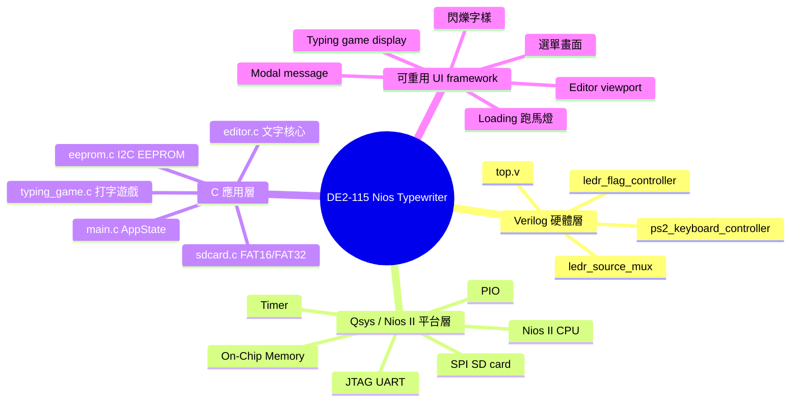

設計理念是：複雜流程與 UI 狀態機交給 C；需要固定時序或持續硬體反應的部分交給 Verilog。

---

## 2. top-level 電路方塊圖與接線

`top.v` 是實體訊號連線圖，最適合用 `flowchart` 表示訊號方向。這張圖保留 flowchart，但它的用途是硬體方塊圖，不是軟體流程圖。

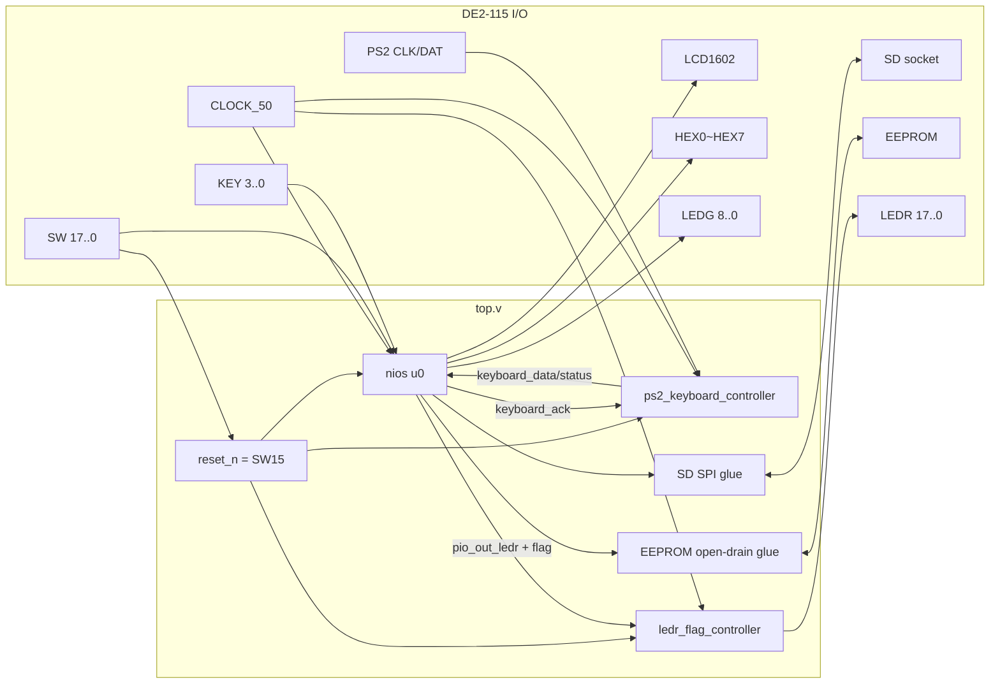

重點接線：

- `reset_n = SW[15]`，`SW15=0` reset，`SW15=1` run。
- `SW[17:0]` 全部輸入 Nios PIO；其中 `SW[6:0]` 是 ASCII，`SW16` 是 Insert / Overwrite，`SW17` 是左右 / 上下移動模式。
- `KEY[3:0]` 輸入 Nios PIO，C 端做 active-low 反相、debounce、pressed-edge 偵測。
- `LEDR[17:0]` 由 `ledr_flag_controller` 輸出，不直接由 Nios PIO 接到板子。
- `LEDG[7:0]` 由一般 LEDG PIO 輸出；`LEDG[8]` 由獨立 1-bit PIO 輸出，給 typing game 作為秒閃冒號。
- `HEX0~HEX7` 的 PIO 是 8-bit，但 top-level 只接 `[6:0]` 到七段顯示器。
- LCD 使用 8-bit data PIO 與 5-bit control PIO。control bit0~4 分別是 `RS`、`RW`、`EN`、`ON`、`BLON`。
- EEPROM SDA 使用 open-drain 類接法，只 drive low 或 release high-Z。
- SD card 使用 SPI mode：`SD_CLK=SCLK`、`SD_CMD=MOSI`、`SD_DAT[0]=MISO`、`SD_DAT[3]=SS_n`，`SD_DAT[1]` 與 `SD_DAT[2]` high-Z。

---

## 3. Qsys / Nios II 子系統

Qsys 系統提供 Nios II CPU、On-Chip Memory、JTAG UART、System ID、Timer、PIO 與 SPI SD card core。這張圖使用 `classDiagram`，因為它較適合表示「CPU 與周邊資源之間的結構關係」，而不是一個執行流程。

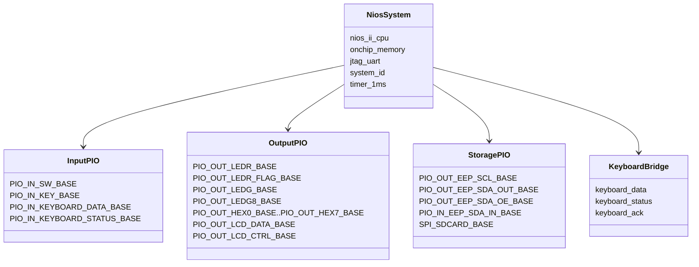

若 Qsys 重新 Generate HDL，必須更新 BSP，否則 `system.h` 可能停在舊版。

---

## 4. PS/2 keyboard controller 內部結構

PS/2 鍵盤由 Verilog 解碼，再透過 PIO 給 Nios C 使用。內部模組管線仍然適合用 flowchart 表示資料從 raw PS/2 frame 逐步轉成 decoded byte。

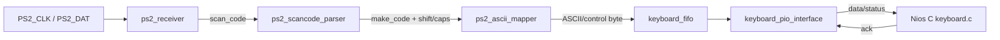

模組職責：

- `ps2_receiver.v`：同步與濾波 PS/2 clock/data，在 falling edge 取樣，解析 start、data、parity、stop bit，並輸出 `scan_code_valid` 或 `frame_error`。
- `ps2_scancode_parser.v`：處理 `E0` extended prefix、`F0` release prefix、Shift 狀態與 Caps Lock，只輸出 make code。
- `ps2_ascii_mapper.v`：把 make code 轉成 printable ASCII、Backspace、LF、Delete 或方向鍵控制碼。
- `keyboard_fifo.v`：16-byte FIFO，避免 C 主迴圈輪詢速度不足導致漏字。
- `keyboard_pio_interface.v`：提供 `keyboard_data`、`keyboard_status`、`keyboard_ack` handshake。

### 4.1 PS/2 keyboard PIO handshake

C 端讀鍵盤是一個互動時序，因此這裡改用 `sequenceDiagram`，比流程圖更清楚呈現 Nios 與 Verilog FIFO 之間的 ack/pop 關係。

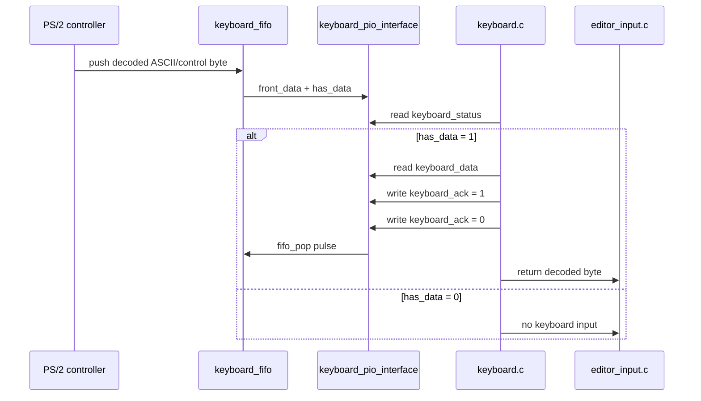

keyboard status：bit0 是 FIFO has data，bit1 是 FIFO full，bit2 是 FIFO overflow 或 PS/2 frame error。

---

## 5. LEDR flag controller

LEDR 有雙來源：Nios C 顯示 progress，Verilog 顯示 blocking I/O activity marquee、confirm blink、error blink。內部選擇邏輯仍使用 flowchart，因為它本質上是硬體 mux 與 priority select。

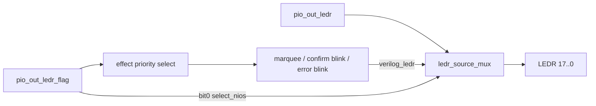

`pio_out_ledr_flag` bit 定義：

| bit | mask | 意義 |
|---|---:|---|
| 0 | `0x01` | 1 選 Nios LEDR；0 選 Verilog effect |
| 1 | `0x02` | `LEDR17` 到 `LEDR0` 跑馬燈 |
| 2 | `0x04` | `LEDR0` 到 `LEDR17` 跑馬燈 |
| 3 | `0x08` | 2 Hz 全燈閃爍 |
| 4 | `0x10` | 5 Hz 全燈閃爍 |
| 5..7 | `0xE0` | 保留 |

當 Verilog 控制 LEDR 且多個 effect bit 同時為 1，priority 是 error blink、confirm blink、right-to-left marquee、left-to-right marquee。`ledr_source_mux.v` 使用 18 個 `hw03_Mux41`，等效成 18-bit 2-to-1 mux。

---

## 6. C 程式分層

C 程式分層不是事件流程，而是模組相依關係，因此使用 `classDiagram` 表示檔案之間的使用關係。

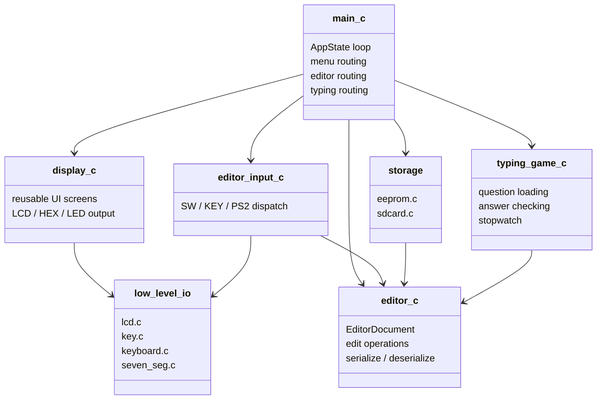

主要檔案職責：

- `main.c`：AppState 主狀態機，整合首頁、editor、SD view、typing game、modal message。
- `editor.c/.h`：`EditorDocument`、文字插入/覆蓋/刪除/換行/移動、序列化。
- `editor_input.c/.h`：把 SW/KEY/PS2 byte 轉成 editor action。
- `display.c/.h`：可重用 UI 畫面框架，提供選單、訊息、確認、錯誤、閃爍 marker、loading 跑馬燈、editor viewport、typing game 畫面等共用顯示元件。
- `menu.c/.h`：共用水平選單。
- `lcd.c/.h`：LCD1602 8-bit PIO driver。
- `key.c/.h`：KEY debounce 與 edge detection。
- `keyboard.c/.h`：讀 PS/2 FIFO PIO。
- `eeprom.c/.h`：24LC32 類 I2C bit-bang。
- `sdcard.c/.h`：SPI SD card 與 FAT16/FAT32 root directory 讀寫。
- `typing_game.c/.h`：題目抽樣、答案比對、秒表、CPM。

---

## 7. `main.c` AppState 狀態機

`main.c` 是狀態機管理，所以這裡使用 `stateDiagram-v2`，比 flowchart 更能表達「目前所在狀態」與狀態轉移。

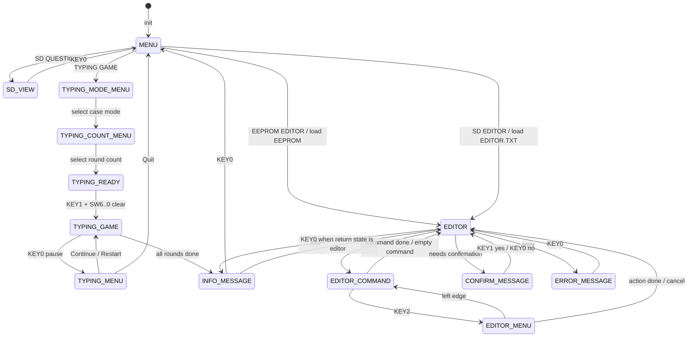

主迴圈每輪會讀 SW、更新 KEY edge、更新 insert mode、取得 ASCII 與 nav mode，再依目前 AppState 處理對應功能。首頁選單包含 `EEPROM EDITOR`、`SD EDITOR`、`SD QUESTIONS`、`TYPING GAME`。VI command 支援 `w`、`q`、`wq`、`x`、`e!`，也能透過 `KEY2` 進入 editor menu。

---

## 8. EditorDocument 與資料流

`EditorDocument` 是 EEPROM editor、SD editor、typing game input 共用的文字核心。這裡使用 `erDiagram` 表示資料結構與儲存格式之間的關係，比流程圖更適合描述資料模型。

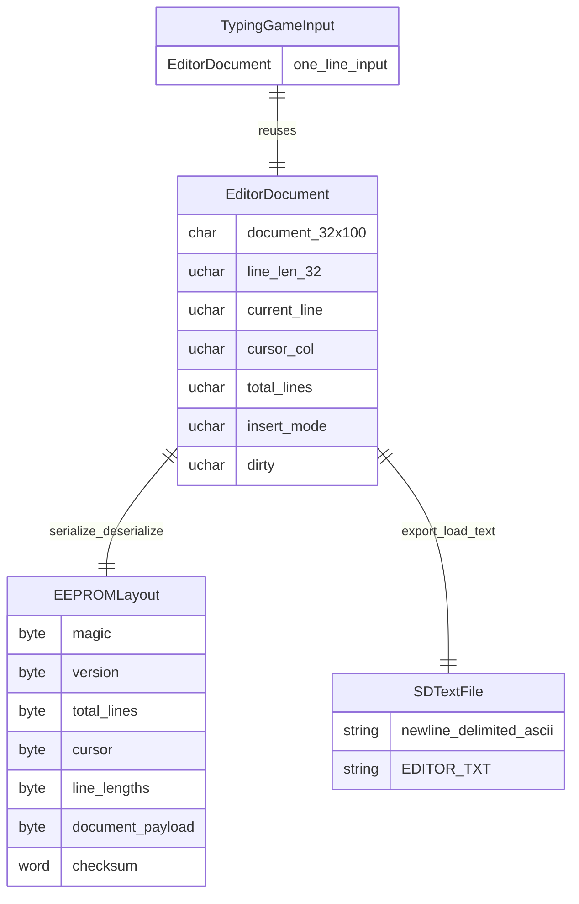

`editor_write_ascii()` 支援 Backspace `0x08`、LF `0x0A`、Delete `0x7F`、printable ASCII `0x20..0x7E`。SD editor 使用 newline-delimited ASCII；EEPROM editor 使用固定 3210-byte binary layout，包含 magic、version、行數、游標、insert mode、line length、文件內容與 checksum。

---

## 9. UI framework 設計理念

本專案的 UI framework 不是單純把 LCD、HEX、LEDR、LEDG 的輸出集中到 `display.c`，而是設計了一組**可重用的顯示畫面與互動樣式**。這裡使用 `mindmap`，因為 UI framework 比較像一組可重用 component / pattern collection。

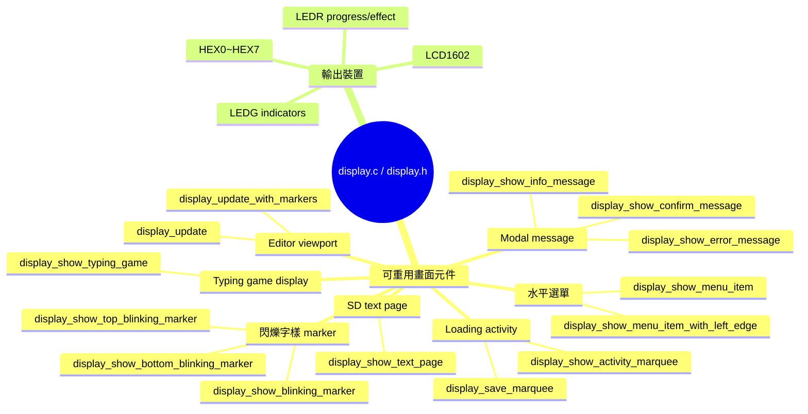

這套 UI framework 的重點是「畫面元件化」：

- **選單畫面**：LCD 第一列顯示選項名稱，第二列顯示左右箭頭與 `目前/總數`，LEDR 同步顯示選單位置進度。
- **訊息畫面**：Info / Confirm / Error 共用一套 modal layout，不同功能只傳入訊息內容。
- **閃爍字樣**：例如 `EEPROM`、`SD`、`END`。這些 marker 是 UI hint，不是文件內容。
- **Loading / activity 畫面**：EEPROM 與 SD card blocking I/O 都呼叫同一套 activity marquee。
- **Editor viewport**：統一處理目前行、下一行、水平捲動、cursor mode、top marker、bottom marker、HEX 與 LEDG 狀態。
- **Typing game 畫面**：重用 editor viewport 概念，但改成第一列顯示輸入、第二列顯示題目。

---

## 10. SD card 讀寫與 FAT 流程

SD card 的重點不是單純流程，而是 Nios C、SPI SD card、FAT parser、UI activity callback 之間的互動，因此用 `sequenceDiagram` 表示讀檔時序。

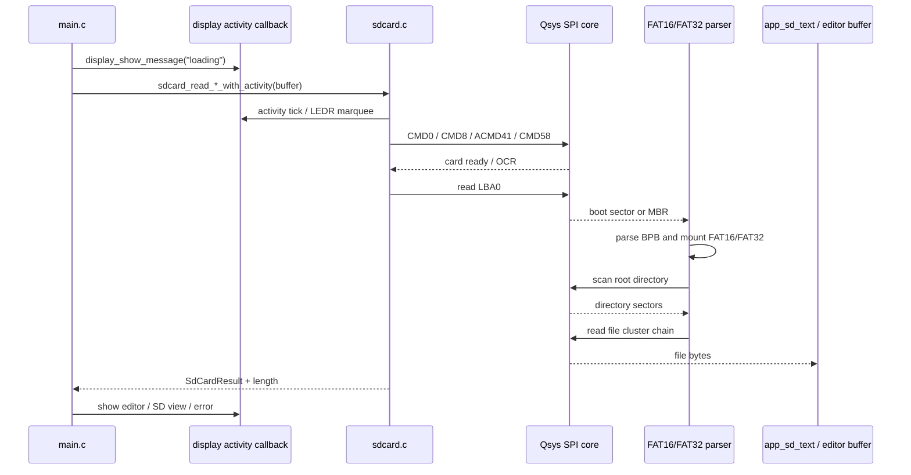

SD 初始化會送 80 clocks、CMD0、CMD8、CMD55+ACMD41、CMD58，並判斷 block addressing。若不是 block-addressed card，會用 CMD16 設定 block length = 512。

FAT mount 支援 FAT16 / FAT32、root directory、8.3 短檔名。不支援 exFAT、長檔名、子目錄 traversal。讀 `QUESTION.TXT` 或 `EDITOR.TXT` 時，會 `sd_init()` → `fat_mount()` → `fat_find_file()` → `fat_read_file()` → copy 到 C buffer 並補 `\0`。

寫 `EDITOR.TXT` 時，會搜尋既有檔與 free directory slot，視 overwrite 決定是否覆寫，分配或重用 cluster，寫 data sector，更新 directory entry，必要時釋放舊 chain。

---

## 11. EEPROM 讀寫流程

EEPROM 是 I2C transaction，適合使用 `sequenceDiagram` 表示 start、address、data、ACK polling 的時序。

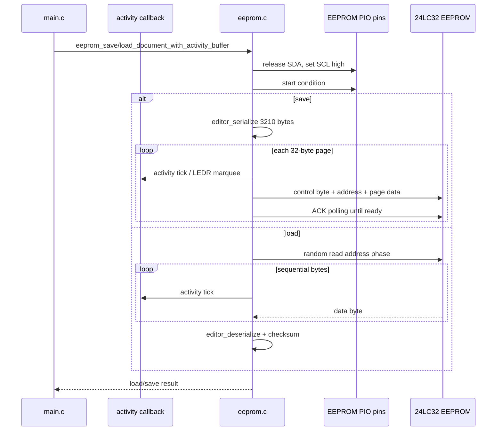

重點：control byte 使用 `0xA0` write、`0xA1` read；page size 為 32 bytes；寫入時不跨 page boundary；每頁寫入後使用 ACK polling 等待內部寫入完成；讀取整份 3210-byte editor layout 後，用 magic/version/checksum 判斷是否有效。

---

## 12. Typing game 流程

Typing game 是明確的遊戲狀態轉移，因此使用 `stateDiagram-v2`。

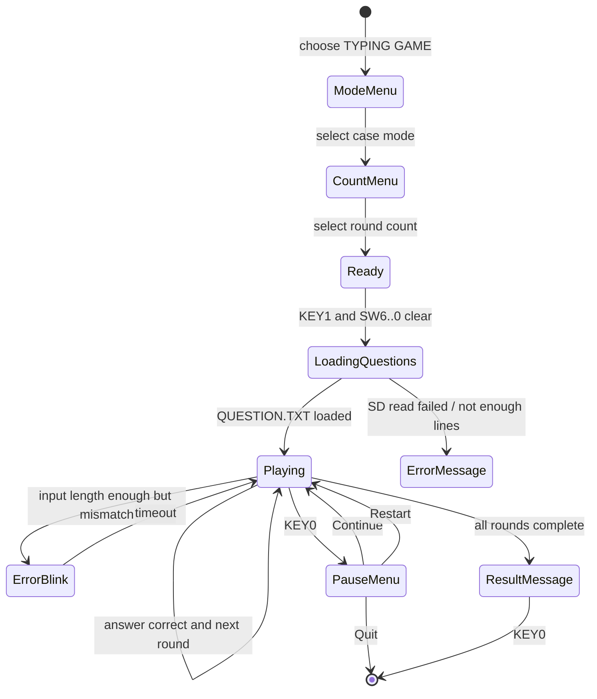

Typing game 從 SD `QUESTION.TXT` 讀題目，最多支援 50 題。題目來源是非空行，長度最多 `LINE_LEN`。大小寫模式包含 `Capitalized`、`Default`、`Random Caps`。

輸入沿用 `editor_input.c`，但 `allow_newline = 0`，因此 Enter 不會換行。秒表使用 Qsys timer 的 `alt_nticks()`，第一次 SW 變化或實際輸入時啟動。完成後以總字數與時間計算 CPM。

---

## 13. 維護與報告重點

報告可強調以下特色：

1. 硬體與軟體分工清楚：Verilog 處理 PS/2 timing 與 LEDR blocking animation，C 處理 UI、editor、SD/FAT、typing game。
2. 同一份 `EditorDocument` 被 EEPROM editor、SD editor、typing game input 重用。
3. `display.c/.h` 是可重用 UI 畫面框架，將選單、閃爍字樣、loading 跑馬燈、modal message、editor viewport、typing game display 等畫面 pattern 提供給不同功能呼叫。
4. SD card 不是 raw sector demo，而是支援 FAT16/FAT32 root directory 讀寫固定短檔名。
5. blocking I/O 期間仍能由 Verilog LEDR controller 顯示 activity marquee。
6. PS/2 keyboard 透過 FIFO 與 PIO handshake 接入 Nios，保留 SW/KEY 測試輸入。

後續修改提醒：Qsys 改動後一定要更新 BSP；LEDR flag bit 若改動，需同步更新 `display.h`、`ledr_flag_controller.v`、`docs/ledr_flag.md`；新增 UI 畫面時優先擴充 `display.c/.h`；新增選單時優先使用 `menu.c/.h`；SD card 目前不支援長檔名、子目錄與 exFAT；EEPROM layout 若改版，應調整 version 或加入相容讀取。
