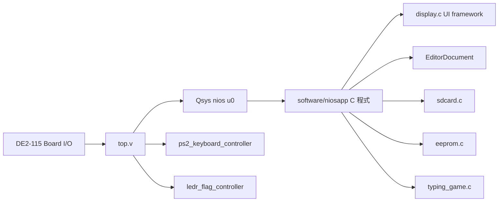
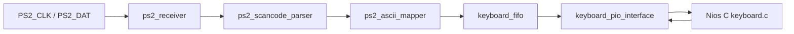

# 專案結構與運作階層整理

本文件整理目前 DE2-115 / Quartus / Qsys / Nios II 專案的硬體與軟體結構，方便後續撰寫報告與繪製方塊圖。本文件不是最終報告，而是工程整理稿。

## 1. 系統總覽

本專案是一個混合式 FPGA 系統：

- Verilog 硬體層：負責 top-level 腳位接線、PS/2 keyboard 解碼、LEDR 硬體燈效控制。
- Qsys / Nios II 層：提供 CPU、On-Chip Memory、Timer、PIO、SPI SD card core。
- C 應用層：負責文字編輯器、SD card 讀寫、FAT16/FAT32 檔案解析、typing game、LCD/HEX/LED UI。

設計理念是：複雜流程與 UI 狀態機交給 C；需要固定時序或持續硬體反應的部分交給 Verilog。

## 2. top-level 接線

`top.v` 是硬體頂層，主要負責把 DE2-115 腳位、Qsys Nios 系統、PS/2 控制器與 LEDR 控制器接起來。

重點接線：

- `CLOCK_50` 接到 `nios u0`、`ps2_keyboard_controller`、`ledr_flag_controller`。
- `reset_n = SW[15]`，`SW15=0` reset，`SW15=1` run。
- `SW[17:0]` 全部輸入 Nios PIO。
  - `SW[6:0]`：ASCII 輸入。
  - `SW16`：Insert / Overwrite。
  - `SW17`：左右 / 上下移動模式。
- `KEY[3:0]` 輸入 Nios PIO，C 端做 active-low 反相、debounce、edge detection。
- `LEDR[17:0]` 由 `ledr_flag_controller` 輸出，不直接由 Nios PIO 接到板子。
- `LEDG[7:0]` 由一般 LEDG PIO 輸出。
- `LEDG[8]` 由獨立 1-bit PIO 輸出，給 typing game 作為秒閃冒號。
- `HEX0~HEX7` 的 PIO 是 8-bit，但 top-level 只接 `[6:0]` 到七段顯示器。
- LCD 使用 8-bit data PIO 與 5-bit control PIO。
- EEPROM SDA 使用 open-drain 類接法，只 drive low 或 release high-Z。
- SD card 使用 SPI mode：`SD_CLK=SCLK`、`SD_CMD=MOSI`、`SD_DAT[0]=MISO`、`SD_DAT[3]=SS_n`。

## 3. Qsys / Nios II 子系統

Qsys 系統提供 Nios II CPU、On-Chip Memory、JTAG UART、System ID、Timer、PIO 與 SPI SD card core。C 程式透過 `system.h` 的 base macro 存取外設。

常用外設包含：

- `PIO_IN_SW_BASE`
- `PIO_IN_KEY_BASE`
- `PIO_OUT_LEDR_BASE`
- `PIO_OUT_LEDR_FLAG_BASE`
- `PIO_OUT_LEDG_BASE`
- `PIO_OUT_LEDG8_BASE`
- `PIO_OUT_HEX0_BASE` 到 `PIO_OUT_HEX7_BASE`
- `PIO_OUT_LCD_DATA_BASE`
- `PIO_OUT_LCD_CTRL_BASE`
- `PIO_OUT_EEP_SCL_BASE`
- `PIO_OUT_EEP_SDA_OUT_BASE`
- `PIO_OUT_EEP_SDA_OE_BASE`
- `PIO_IN_EEP_SDA_IN_BASE`
- `PIO_IN_KEYBOARD_DATA_BASE`
- `PIO_IN_KEYBOARD_STATUS_BASE`
- `PIO_OUT_KEYBOARD_ACK_BASE`
- `SPI_SDCARD_BASE`

若 Qsys 重新 Generate HDL，必須更新 BSP，否則 `system.h` 可能停在舊版。

## 4. PS/2 keyboard controller

PS/2 鍵盤由 Verilog 解碼，再透過 PIO 給 Nios C 使用。

各模組職責：

- `ps2_receiver.v`：同步與濾波 PS/2 clock/data，在 falling edge 取樣，解析 start、data、parity、stop bit。
- `ps2_scancode_parser.v`：處理 `E0` extended prefix、`F0` release prefix、Shift 狀態與 Caps Lock。
- `ps2_ascii_mapper.v`：把 make code 轉成 ASCII、Backspace、LF、Delete 或方向鍵控制碼。
- `keyboard_fifo.v`：16-byte FIFO，避免 C 主迴圈輪詢速度不足導致漏字。
- `keyboard_pio_interface.v`：提供 `keyboard_data`、`keyboard_status`、`keyboard_ack` handshake。

keyboard status：

- bit0：FIFO has data。
- bit1：FIFO full。
- bit2：FIFO overflow 或 PS/2 frame error。

C 端 `keyboard_read()` 會先讀 status，若有資料再讀 data，最後 pulse ack 讓 Verilog pop FIFO。

## 5. LEDR flag controller

LEDR 有雙來源：

- Nios C：顯示 editor line progress、menu progress、typing round progress。
- Verilog：顯示 blocking I/O activity marquee、confirm blink、error blink。

`pio_out_ledr_flag` bit 定義：

| bit | mask | 意義 |
|---|---:|---|
| 0 | `0x01` | 1 選 Nios LEDR；0 選 Verilog effect |
| 1 | `0x02` | `LEDR17` 到 `LEDR0` 跑馬燈 |
| 2 | `0x04` | `LEDR0` 到 `LEDR17` 跑馬燈 |
| 3 | `0x08` | 2 Hz 全燈閃爍 |
| 4 | `0x10` | 5 Hz 全燈閃爍 |
| 5..7 | `0xE0` | 保留 |

當 Verilog 控制 LEDR 且多個 effect bit 同時為 1，priority 是 error blink、confirm blink、right-to-left marquee、left-to-right marquee。

## 6. C 程式分層

- `main.c`：AppState 主狀態機。
- `editor.c/.h`：`EditorDocument`、文字插入/覆蓋/刪除/換行/移動、序列化。
- `editor_input.c/.h`：把 SW/KEY/PS2 byte 轉成 editor action。
- `display.c/.h`：UI facade，統一控制 LEDR、LEDG、HEX、LCD。
- `menu.c/.h`：共用水平選單。
- `lcd.c/.h`：LCD1602 8-bit PIO driver。
- `key.c/.h`：KEY debounce 與 edge detection。
- `keyboard.c/.h`：讀 PS/2 FIFO PIO。
- `eeprom.c/.h`：24LC32 類 I2C bit-bang。
- `sdcard.c/.h`：SPI SD card 與 FAT16/FAT32 root directory 讀寫。
- `typing_game.c/.h`：題目抽樣、答案比對、秒表、CPM。
