# 專案結構與運作階層整理

本文件整理目前 DE2-115 / Quartus / Qsys / Nios II 專案的硬體與軟體結構，方便後續撰寫報告、畫方塊圖、說明系統分工與進行維護。本文件不是最終報告，而是工程整理稿，因此會保留較多模組責任、接線、資料流、設計理由與維護注意事項。

主要依據檔案：`top.v`、`ps2_keyboard_controller.v`、`ps2_receiver.v`、`ps2_scancode_parser.v`、`ps2_ascii_mapper.v`、`keyboard_fifo.v`、`keyboard_pio_interface.v`、`ledr_flag_controller.v`、`ledr_source_mux.v`、`software/niosapp/main.c`、`editor.c/.h`、`editor_input.c/.h`、`display.c/.h`、`menu.c/.h`、`lcd.c/.h`、`key.c/.h`、`keyboard.c/.h`、`eeprom.c/.h`、`sdcard.c/.h`、`typing_game.c/.h`。

---

## 1. 系統總覽

本專案是一個混合式 FPGA 系統。DE2-115 板子上的實體 I/O 先進入 `top.v`，其中一部分訊號直接交給 Qsys 產生的 Nios II 系統，另一部分則由自製 Verilog 模組處理。整體可以分成四個層次：最底層是板上硬體與 top-level 腳位；第二層是 Verilog 即時硬體模組；第三層是 Qsys / Nios II 平台與 PIO/SPI/Timer；最上層是 C 語言寫成的應用程式、文字編輯器、SD/EEPROM 儲存、打字遊戲與 UI framework。

這樣分層的主要目的，是讓「需要穩定時序或持續反應」的工作交給硬體，例如 PS/2 clock 解碼、FIFO 暫存、LEDR loading 跑馬燈；而「流程複雜、容易變動、像應用程式邏輯」的工作交給 C，例如選單、檔案讀寫、文字編輯、錯誤訊息、打字遊戲狀態。這讓專案既能維持 FPGA 硬體展示效果，也能保留 Nios II C code 容易修改的優點。

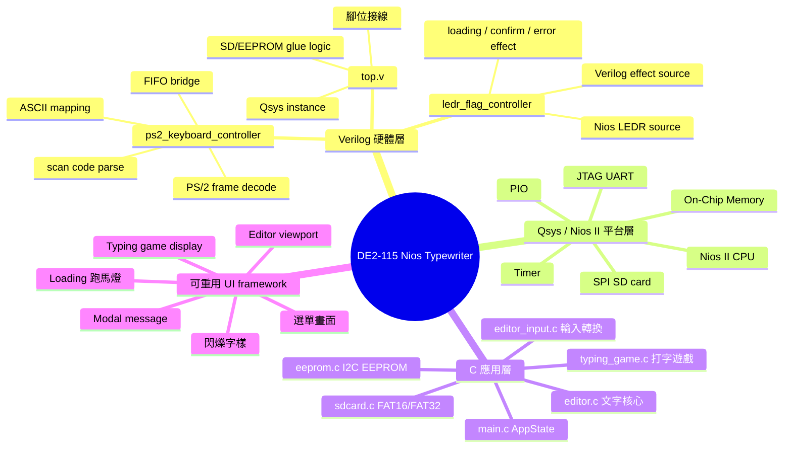

從報告角度來看，本專案不是單純的 Nios II PIO demo。它的重點在於把 FPGA 板子包裝成一個可以獨立操作的小型互動系統：使用者可以透過 SW、KEY、PS/2 keyboard 輸入文字；透過 LCD、HEX、LEDR、LEDG 取得狀態回饋；透過 EEPROM 與 SD card 保存資料；最後還能延伸成 typing game 這種展示性較強的應用。

---

## 2. top-level 電路方塊圖與接線

`top.v` 是硬體頂層，負責把 DE2-115 實體腳位、Qsys 產生的 `nios u0`、PS/2 keyboard controller、LEDR flag controller 與 SD/EEPROM glue logic 接起來。這一層本身不處理高階應用邏輯，而是決定訊號要進入哪個硬體模組、哪些 PIO 由 Nios 控制、哪些訊號需要 open-drain 或 tri-state 類型的接法。

這張圖保留 `flowchart`，因為 top-level 本質上是一張硬體訊號連線圖。圖中的箭頭代表訊號方向，不代表軟體執行順序。

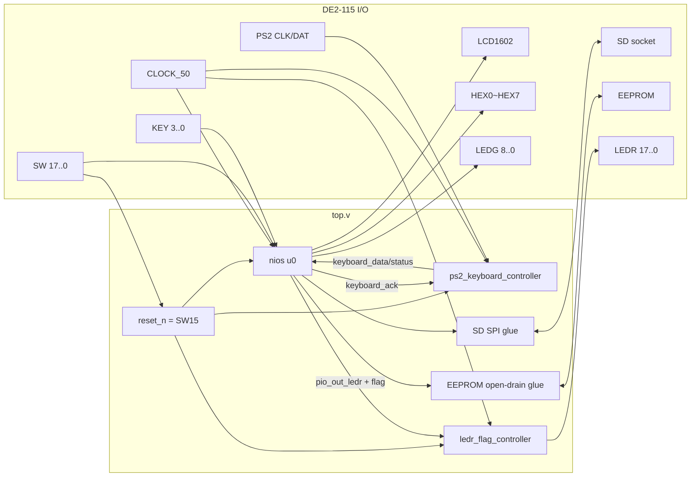

重點接線與設計理由如下：

- `reset_n = SW[15]`，也就是 `SW15=0` reset，`SW15=1` run。這種做法讓 reset 不佔用 KEY，方便 KEY 全部拿來做互動操作。
- `SW[17:0]` 全部輸入 Nios PIO。C 端再切出不同用途：`SW[6:0]` 是 7-bit ASCII；`SW16` 是 Insert / Overwrite；`SW17` 是左右移動或上下移動的 nav mode。
- `KEY[3:0]` 輸入 Nios PIO。DE2-115 的 KEY 通常是 active-low，因此 C 端 `key.c` 會先反相，再做 debounce 與 pressed-edge 偵測，避免長按或機械彈跳造成多次觸發。
- `LEDR[17:0]` 不直接由 Nios PIO 接到板子，而是先進入 `ledr_flag_controller`。這樣可以在一般情況讓 C 控制 LEDR progress，也可以在 SD/EEPROM blocking I/O 期間切換給 Verilog 產生硬體跑馬燈。
- `LEDG[7:0]` 由一般 LEDG PIO 輸出；`LEDG[8]` 由獨立 1-bit PIO 輸出，主要給 typing game 秒閃提示使用。
- `HEX0~HEX7` 的 PIO 是 8-bit，但 top-level 只接 `[6:0]` 到七段顯示器。小數點 dp 若未使用，可以不接或固定關閉。
- LCD 使用 8-bit data PIO 與 5-bit control PIO。control bit0~4 分別是 `RS`、`RW`、`EN`、`ON`、`BLON`，由 `lcd.c` 產生命令與資料寫入時序。
- EEPROM SDA 使用 open-drain 類接法，只能 drive low 或 release high-Z；讀取時由 `PIO_IN_EEP_SDA_IN_BASE` 取得 SDA 狀態。
- SD card 使用 SPI mode：`SD_CLK=SCLK`、`SD_CMD=MOSI`、`SD_DAT[0]=MISO`、`SD_DAT[3]=SS_n`，`SD_DAT[1]` 與 `SD_DAT[2]` high-Z。這表示本專案沒有使用 SD native 4-bit mode，而是使用嵌入式系統較容易實作的 SPI mode。

---

## 3. Qsys / Nios II 子系統

Qsys / Platform Designer 產生的 Nios II 系統是 C 程式能控制硬體的中介層。C 程式本身不能直接操作 DE2-115 的腳位，而是透過 Qsys 中的 Avalon-MM PIO、SPI、Timer 等周邊來讀寫硬體。`system.h` 中的 `*_BASE` macro 就是 C code 與硬體周邊之間的地址對應表。

這張圖使用 `classDiagram`，因為這裡要說明的是平台中有哪些資源，以及這些資源如何被 Nios II 使用，而不是一個固定的執行流程。

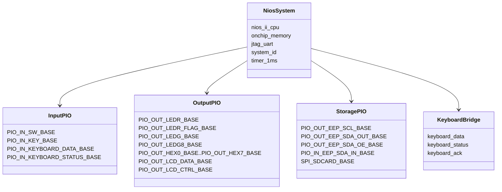

這一層可以理解為「硬體資源表」。例如 `PIO_IN_SW_BASE` 讓 C 可以讀滑動開關；`PIO_OUT_HEX0_BASE` 到 `PIO_OUT_HEX7_BASE` 讓 C 可以分別控制八個七段顯示器；`SPI_SDCARD_BASE` 則讓 `sdcard.c` 可以透過 Qsys SPI core 傳送 CMD0、CMD8、CMD17、CMD24 等 SD card 指令。

維護時最需要注意的是：只要 Qsys 裡新增、刪除或重新命名 PIO，都會影響 `system.h`。因此修改 Qsys 後必須重新 Generate HDL，回到 Quartus 編譯，並在 Eclipse / Nios II SBT 中重新更新 BSP。若 BSP 沒有更新，C code 可能會找不到新的 `*_BASE`，或仍然使用舊的 base address，造成硬體行為不符合預期。

---

## 4. PS/2 keyboard controller 內部結構

PS/2 鍵盤訊號不適合直接交給 Nios C 輪詢，原因是 PS/2 protocol 有自己的 clock，資料是一個 bit 一個 bit 傳送，而且需要檢查 start bit、parity、stop bit。若直接在 C 端輪詢 PS2_CLK / PS2_DAT，很容易因為主迴圈正在做 SD card 或 EEPROM I/O 而錯過 bit。因此本專案把 PS/2 解碼放在 Verilog 硬體中處理。

整個 keyboard controller 是一條硬體資料管線：從 PS/2 clock/data 進來，先解析成 scan code，再處理 make/release、extended key、Shift、Caps Lock，最後轉成 ASCII 或控制碼，放入 FIFO 給 Nios 讀取。這一段仍適合用 flowchart，因為它描述的是資料處理管線。

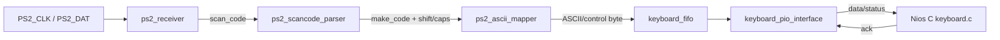

模組職責：

- `ps2_receiver.v` 負責最底層 PS/2 frame 接收。它會同步與濾波 PS/2 clock/data，在 falling edge 取樣，檢查 start bit 是否為 0、stop bit 是否為 1，以及 parity 是否正確。
- `ps2_scancode_parser.v` 負責把 scan code 轉成「按下事件」。它會處理 `E0` extended prefix、`F0` release prefix、Shift 狀態與 Caps Lock 狀態。此模組只輸出 make code，避免放開按鍵時又產生一次輸入。
- `ps2_ascii_mapper.v` 負責把 make code 轉成 C 端能理解的 byte。例如英文字母會依 Shift / Caps Lock 轉成大小寫；Enter 轉成 LF `0x0A`；Backspace 轉成 `0x08`；Delete 轉成 `0x7F`；方向鍵轉成 `0x80` 到 `0x83` 的 control byte。
- `keyboard_fifo.v` 是 16-byte FIFO。它的目的不是大量緩衝，而是避免 C 主迴圈剛好正在更新 LCD、寫 EEPROM 或等 SD card 回應時漏掉使用者快速按鍵。
- `keyboard_pio_interface.v` 將 FIFO front data、empty/full/overflow 狀態包成 PIO 訊號，並接收 C 端送回來的 ack pulse。

### 4.1 PS/2 keyboard PIO handshake

C 端讀鍵盤是一個互動時序，因此這裡使用 `sequenceDiagram`。重點是 C 不直接控制 FIFO 指標，而是透過 `keyboard_ack` 讓 Verilog pop 一筆資料。

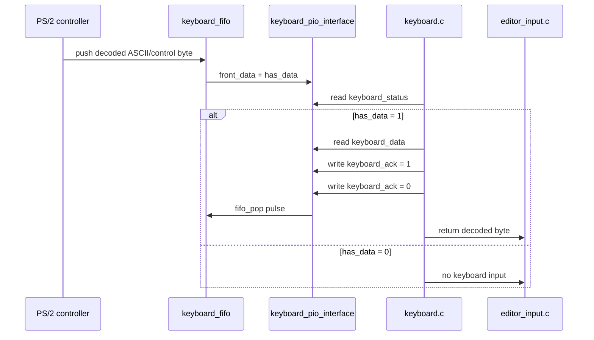

keyboard status 的 bit0 表示 FIFO has data，bit1 表示 FIFO full，bit2 表示 FIFO overflow 或 PS/2 frame error。若 bit2 被觸發，代表曾經有資料來不及被 C 讀走，或 PS/2 frame 在硬體層發生錯誤。這個狀態可用來在 UI 上提示使用者輸入過快或鍵盤訊號異常。

---

## 5. LEDR flag controller

LEDR 在本專案中有兩種角色。第一種是一般 UI 狀態，例如 editor 的行數進度、typing game 的題數進度，這些由 C 計算後輸出到 `PIO_OUT_LEDR_BASE`。第二種是「不應該依賴 C 主迴圈更新」的提示效果，例如 SD card / EEPROM 讀寫期間的 loading 跑馬燈、確認閃爍、錯誤閃爍。後者由 Verilog `ledr_flag_controller` 直接根據 clock 產生，因此即使 Nios 正在 blocking I/O，LEDR 仍會持續動作。

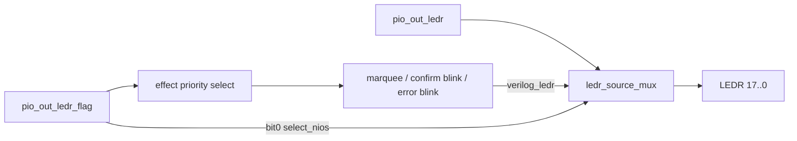

`pio_out_ledr_flag` bit 定義：

| bit | mask | 意義 |
|---|---:|---|
| 0 | `0x01` | 1 選 Nios LEDR；0 選 Verilog effect |
| 1 | `0x02` | `LEDR17` 到 `LEDR0` 跑馬燈 |
| 2 | `0x04` | `LEDR0` 到 `LEDR17` 跑馬燈 |
| 3 | `0x08` | 2 Hz 全燈閃爍 |
| 4 | `0x10` | 5 Hz 全燈閃爍 |
| 5..7 | `0xE0` | 保留 |

這個設計的價值在於「控制權切換」。C 端只要設定 flag，就可以決定 LEDR 是由 Nios 輸出的 progress mask 控制，還是由 Verilog 硬體效果控制。當 Verilog 控制 LEDR 且多個 effect bit 同時為 1，priority 是 error blink、confirm blink、right-to-left marquee、left-to-right marquee。`ledr_source_mux.v` 使用 18 個 `hw03_Mux41`，等效成 18-bit 2-to-1 mux。

---

## 6. C 程式分層

C 程式不是全部寫在 `main.c` 裡，而是拆成多個模組。這樣做的原因是：文字編輯、畫面顯示、按鍵處理、SD card、EEPROM、typing game 都有各自的狀態與細節，如果全部放在主迴圈會很難維護。現在的架構是由 `main.c` 負責應用層 routing，其餘功能由各模組提供較乾淨的 API。

這張圖使用 `classDiagram`，因為它描述的是檔案之間的依賴關係，而不是執行順序。

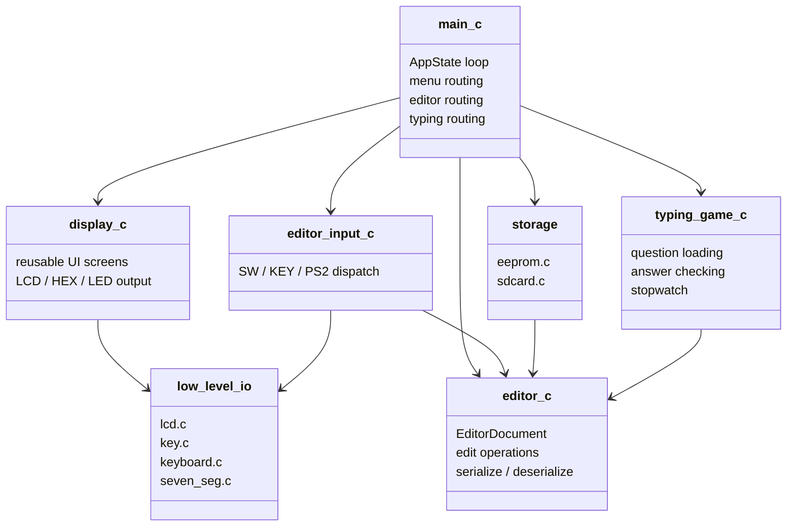

主要檔案職責：

- `main.c`：AppState 主狀態機，整合首頁、editor、SD view、typing game、modal message。它決定「現在處於哪個功能」以及 KEY/SW 事件要交給哪個模組處理。
- `editor.c/.h`：文字核心。它不關心 LCD 或 KEY，只負責 `EditorDocument` 的資料結構、插入/覆蓋/刪除/換行/游標移動，以及 EEPROM binary layout 的 serialize / deserialize。
- `editor_input.c/.h`：輸入轉換層。它把 SW/KEY 與 PS/2 keyboard byte 轉成 editor action，讓 editor 本身不用知道輸入來源。
- `display.c/.h`：可重用 UI 畫面框架，提供選單、訊息、確認、錯誤、閃爍 marker、loading 跑馬燈、editor viewport、typing game 畫面等共用顯示元件。
- `menu.c/.h`：共用水平選單。首頁、editor menu、typing game menu 都可以用同一套選單邏輯。
- `lcd.c/.h`：LCD1602 8-bit PIO driver，處理 LCD command/data write、enable pulse、cursor mode、固定 16 字元輸出。
- `key.c/.h`：KEY debounce 與 edge detection，避免 C 主迴圈直接使用 raw KEY 值造成抖動問題。
- `keyboard.c/.h`：讀 PS/2 FIFO PIO，負責 status/data/ack handshake。
- `eeprom.c/.h`：24LC32 類 I2C bit-bang，負責 start/stop、byte read/write、ACK polling、page write。
- `sdcard.c/.h`：SPI SD card 與 FAT16/FAT32 root directory 讀寫，負責把 SD card 當成 block device，再在上面解析簡化 FAT 檔案系統。
- `typing_game.c/.h`：題目抽樣、答案比對、秒表、CPM 計算。

這種分層讓專題報告可以清楚說明：底層 driver 處理硬體細節，中層 editor/storage/UI 提供可重用功能，最上層 `main.c` 組合成實際應用。

---

## 7. `main.c` AppState 狀態機

`main.c` 是整個 C 應用的狀態管理中心。每一輪主迴圈都會讀 SW、更新 KEY edge、更新 insert mode、取得 ASCII 與 nav mode，接著根據目前 `AppState` 決定要更新首頁選單、editor、VI command、SD view、typing game 或 modal message。

這裡使用 `stateDiagram-v2`，因為它比 flowchart 更能表達「目前所在狀態」與「事件造成狀態轉移」。

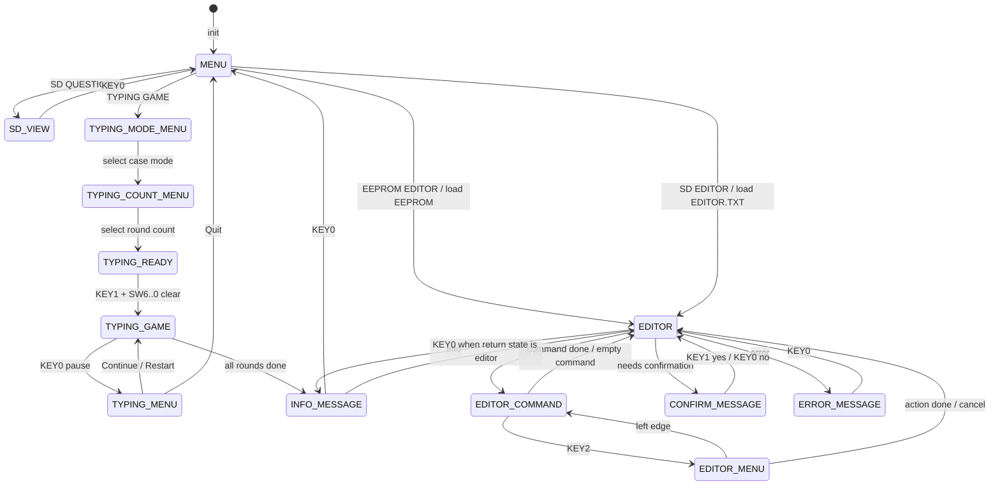

首頁選單包含 `EEPROM EDITOR`、`SD EDITOR`、`SD QUESTIONS`、`TYPING GAME`。當使用者選擇 EEPROM editor，系統會先初始化 EEPROM 並嘗試讀取固定 binary layout；當使用者選擇 SD editor，系統會從 SD card 讀取 `EDITOR.TXT` 並轉入 `EditorDocument`；當選擇 SD QUESTIONS，則會讀取並瀏覽 `QUESTION.TXT`；當選擇 TYPING GAME，則會進入大小寫模式選單、題數選單、ready 畫面，再開始遊戲。

Editor 主畫面中，`KEY0` 進入 VI command，`KEY1` 寫入目前 `SW[6:0]` ASCII，`KEY3/KEY2` 依 `SW17` 決定左右或上下移動。VI command 支援 `w`、`q`、`wq`、`x`、`e!`，也能透過 `KEY2` 進入 editor menu。當操作需要確認，例如 dirty document 離開、覆寫 SD 檔案、清空全部文字，就會切換到 confirm modal。

---

## 8. EditorDocument 與資料流

`EditorDocument` 是 EEPROM editor、SD editor、typing game input 共用的文字核心。這個資料結構把文字內容、每行長度、目前行、游標欄位、總行數、insert mode 與 dirty flag 放在同一個物件中。editor 的所有操作都只修改這個物件，因此它可以同時支援不同儲存來源與不同顯示畫面。

這裡使用 `erDiagram` 表示資料模型與儲存格式之間的關係。

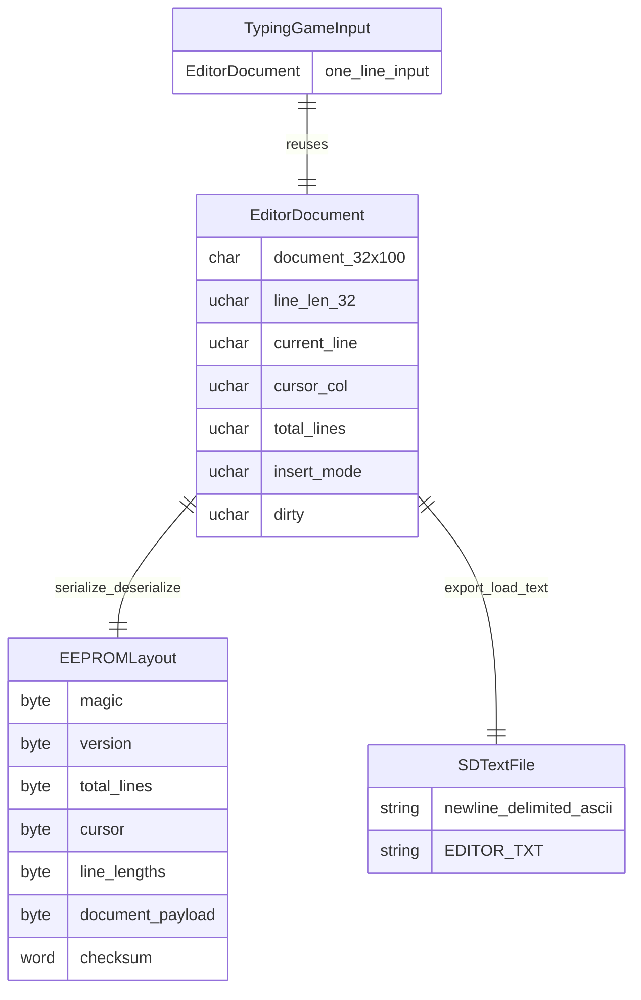

`editor_write_ascii()` 支援 Backspace `0x08`、LF `0x0A`、Delete `0x7F`、printable ASCII `0x20..0x7E`。在 insert mode 中，輸入字元會把游標右側文字往右推；在 overwrite mode 中，輸入字元會直接覆蓋目前游標位置。Backspace 在行首時可以把目前行接回上一行；LF 則會把目前行從游標位置切開成新行。

SD editor 使用 newline-delimited ASCII，也就是 `EDITOR.TXT` 裡的換行會被轉成 `EditorDocument` 的多行內容；儲存時再由 `editor_export_text()` 轉回文字檔。EEPROM editor 使用固定 3210-byte binary layout，包含 magic、version、行數、游標、insert mode、line length、文件內容與 checksum。這種固定 layout 雖然不如文字檔直觀，但適合 EEPROM，因為它可以直接用固定大小讀寫並檢查資料是否有效。

---

## 9. UI framework 設計理念

本專案的 UI framework 不是單純把 LCD、HEX、LEDR、LEDG 的輸出集中到 `display.c`，而是設計了一組可重用的顯示畫面與互動樣式。不同功能不需要各自重寫 LCD 排版、LED 狀態、七段顯示或等待提示，而是呼叫已經定義好的 UI pattern，讓整個系統看起來像同一套介面。

這裡使用 `mindmap`，因為 UI framework 比較像一組可重用 component / pattern collection。

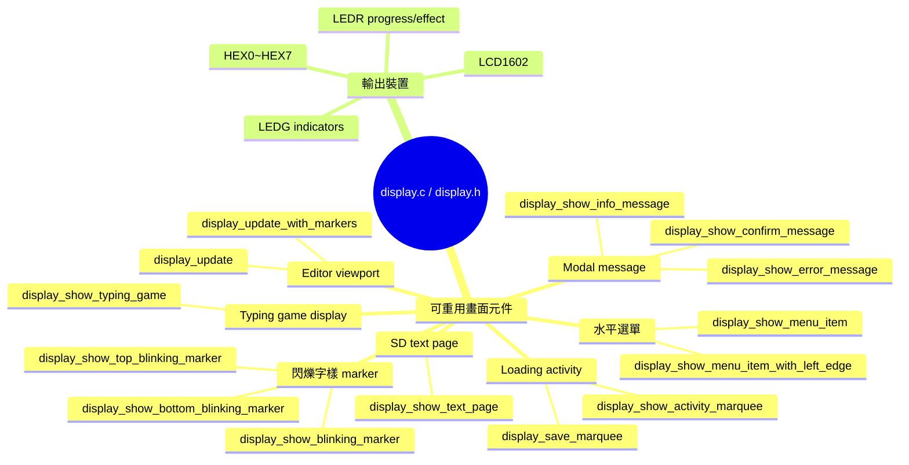

這套 UI framework 的重點是「畫面元件化」：

- **選單畫面**：LCD 第一列顯示選項名稱，第二列顯示左右箭頭與 `目前/總數`，LEDR 同步顯示選單位置進度。首頁、editor menu、typing game menu 都可以沿用。
- **訊息畫面**：Info / Confirm / Error 共用一套 modal layout，不同功能只傳入訊息內容。這讓錯誤、確認、完成提示在不同功能中有一致的操作邏輯。
- **閃爍字樣**：例如 `EEPROM`、`SD`、`END`。這些 marker 是 UI hint，不是文件內容，用來提示目前正在看哪種來源或是否到達文件結尾。
- **Loading / activity 畫面**：EEPROM 與 SD card blocking I/O 都呼叫同一套 activity marquee。若 LEDR flag hardware 存在，跑馬燈由 Verilog 持續產生；若不存在，則可退回 C 端更新 LEDR。
- **Editor viewport**：統一處理目前行、下一行、水平捲動、cursor mode、top marker、bottom marker、HEX 與 LEDG 狀態。
- **Typing game 畫面**：重用 editor viewport 概念，但改成第一列顯示輸入、第二列顯示題目，並同步顯示時間、題數進度、錯誤提示與 ASCII。

因此，`display.c/.h` 在架構上的角色比較接近小型 UI component library。`main.c`、`sdcard.c`、`eeprom.c`、`typing_game.c` 等功能模組只決定現在要顯示哪一種畫面，實際 LCD 排版、LED 效果、HEX 欄位與 cursor 行為都由 display framework 統一處理。

---

## 10. SD card 讀寫與 FAT 流程

`sdcard.c` 是本專案中較複雜的底層模組之一，因為它同時處理兩件事：第一是透過 Qsys SPI core 與 SD card 做 block-level 通訊；第二是在讀到的 sector 上解析簡化 FAT16/FAT32 檔案系統。也就是說，SD card 對上層而言像是「檔案」，但對底層而言其實是「一個 512-byte sector 為單位的 block device」。

本專案採用 SD card 的 SPI mode，而不是 SD native 1-bit / 4-bit mode。原因是 SPI mode 可以用通用 SPI master 控制，接線與時序都比較容易放進 Nios II + Qsys 的架構中。缺點是速度通常不如 native SD mode，但本專題只需要讀寫 `QUESTION.TXT` 與 `EDITOR.TXT`，資料量不大，因此 SPI mode 足夠使用。

### 10.1 SD card 初始化與讀檔時序

SD card 的重點不是單純流程，而是 Nios C、SPI SD card、FAT parser、UI activity callback 之間的互動，因此用 `sequenceDiagram` 表示讀檔時序。

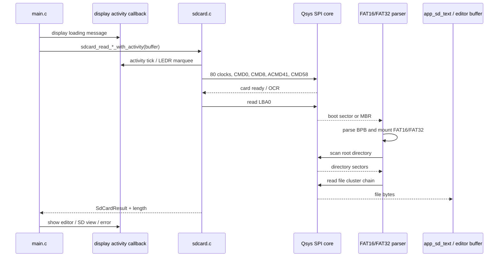

初始化時，程式會先送 clock 讓 SD card 進入可接收指令的狀態，再送 CMD0 讓卡片進入 idle。接著用 CMD8 判斷是否為 SD v2 以上卡片，使用 CMD55 + ACMD41 反覆等待卡片完成初始化，最後用 CMD58 讀 OCR，判斷是否為 high-capacity card。若卡片不是 block addressing，程式會用 CMD16 把 block length 設為 512 bytes，方便後續 FAT sector 讀寫。

讀 sector 時主要使用 CMD17。SD card 接受 CMD17 後，不會立刻吐出 512 bytes，而是先回應 command response，接著 host 必須持續送 dummy byte `0xFF` 產生 clock，直到收到 data token `0xFE`，再連續讀出 512-byte data block 與 2-byte CRC。即使本專案沒有啟用資料 CRC 檢查，CRC bytes 仍然必須讀掉，否則下一次 SPI transaction 會錯位。

寫 sector 時主要使用 CMD24。host 送出 CMD24 與目標 sector address 後，等待 card 接受指令，再送 data token `0xFE`、512-byte data block 與 2-byte CRC。卡片會回傳 data response，之後進入 busy 狀態。此時 host 必須持續讀 MISO，直到 card 釋放 busy，才能進行下一個 command。

### 10.2 FAT mount 與檔案尋找

SD card 初始化完成後，還不能直接用檔名讀檔。`sdcard.c` 必須先 mount FAT volume。程式會先讀 LBA0，判斷它是 FAT boot sector 還是 MBR。若 LBA0 是 MBR，程式會讀第一個 partition 的起始 LBA，再到該位置解析 boot sector / BPB。

FAT mount 的主要工作是計算幾個重要位置：

- FAT 表從哪個 LBA 開始。
- root directory 在哪裡。
- data region 從哪裡開始。
- 每個 cluster 有幾個 sector。
- 目前是 FAT16 還是 FAT32。

這些資訊決定後續如何把 cluster number 轉成 sector LBA。FAT 檔案系統中，directory entry 只記錄檔案第一個 cluster 與檔案大小；如果檔案跨越多個 cluster，就必須透過 FAT entry 一個一個追蹤 cluster chain。

本專案刻意限制功能範圍，只支援 root directory、8.3 短檔名與固定檔名，例如 `QUESTION.TXT`、`EDITOR.TXT`。這樣可以避免處理長檔名 LFN、子目錄 traversal、exFAT、複雜檔案時間戳等問題，讓程式碼維持在可展示、可維護的範圍內。

### 10.3 讀取 `QUESTION.TXT` 與 `EDITOR.TXT`

讀 `QUESTION.TXT` 或 `EDITOR.TXT` 時，流程是：`sd_init()` → `fat_mount()` → `fat_find_file()` → `fat_read_file()` → copy 到 C buffer 並補 `\0`。如果檔案大小超過 buffer，會回傳 `SDCARD_OK_TRUNCATED`，上層可以選擇顯示 warning 或只使用前面可容納的內容。

`QUESTION.TXT` 主要給 SD question viewer 與 typing game 使用。SD question viewer 會把文字當成多行頁面瀏覽；typing game 則會從非空行中抽題。`EDITOR.TXT` 則是 SD editor 的固定儲存檔，讀入後會透過 `editor_load_text()` 轉成 `EditorDocument`。

### 10.4 寫入 `EDITOR.TXT`

寫 `EDITOR.TXT` 時，流程比讀檔更複雜，因為必須處理目錄項、cluster 配置與 FAT 更新。程式會先搜尋 root directory 中是否已經存在 `EDITOR.TXT`，同時記錄可用的 free directory slot。若檔案已存在且允許 overwrite，會準備覆寫；若檔案不存在，則會用 free slot 建立新的 directory entry。

接著程式會根據輸出文字大小計算需要幾個 cluster，分配或重用 cluster，將資料以 512-byte sector 寫入，最後更新 FAT chain 與 directory entry。若覆寫後新檔案使用的 cluster 比舊檔少，還要釋放舊 chain 中多餘的 cluster。這就是為什麼 SD 寫入比 EEPROM 固定 layout 更麻煩：EEPROM 只要照地址寫固定 bytes，SD card 則必須維護檔案系統的一致性。

### 10.5 本專案 SD 實作範圍

目前 SD card 模組的定位是「足夠支援專題功能的最小 FAT16/FAT32 實作」，不是完整通用檔案系統。支援項目與限制如下：

| 項目 | 狀態 |
|---|---|
| SPI mode 初始化 | 支援 |
| CMD0 / CMD8 / ACMD41 / CMD58 | 支援 |
| CMD17 single block read | 支援 |
| CMD24 single block write | 支援 |
| FAT16 / FAT32 mount | 支援 |
| MBR 或直接 boot sector | 支援 |
| root directory 搜尋 | 支援 |
| 8.3 短檔名 | 支援 |
| `QUESTION.TXT` 讀取 | 支援 |
| `EDITOR.TXT` 讀寫 | 支援 |
| Long File Name | 不支援 |
| 子目錄 traversal | 不支援 |
| exFAT | 不支援 |
| 多檔案 general-purpose API | 不支援 |

### 10.6 SD card / FAT 延伸閱讀

以下連結可作為後續理解 SD 通訊協定與 FAT 檔案系統的參考：

- [SD Association - Simplified Specifications](https://www.sdcard.org/downloads/pls/)：官方簡化規格下載頁。若要查 SD card command、response、SPI mode 與 Physical Layer Specification，應優先從這裡找。
- [Elm-Chan - How to Use MMC/SDC](https://elm-chan.org/docs/mmc/mmc_e.html)：非常適合嵌入式系統入門的 SD/MMC SPI mode 說明，包含 CMD0、CMD8、ACMD41、CMD58、CMD17、CMD24、data token、busy 等流程。
- [Elm-Chan - FatFs Generic FAT Filesystem Module](https://elm-chan.org/fsw/ff/)：FatFs 是嵌入式系統常用的 FAT 檔案系統模組。雖然本專案沒有直接使用 FatFs，但它很適合當作日後擴充完整檔案系統時的參考。
- [PJRC - Understanding FAT32 Filesystems](https://www.pjrc.com/tech/8051/ide/fat32.html)：用韌體開發角度解釋 FAT32 layout、MBR、BPB、cluster、directory entry 與 FAT chain，適合理解本專案 `fat_mount()` 與 `fat_find_file()` 的設計。
- [Microsoft FAT General Overview of On-Disk Format](https://download.microsoft.com/download/1/6/1/161ba512-40e2-4cc9-843a-923143f3456c/fatgen103.doc)：Microsoft FAT on-disk format 文件，適合查欄位定義與更正式的 FAT layout。

---

## 11. EEPROM 讀寫流程

EEPROM 使用 C 端 bit-bang I2C，而不是使用 Qsys I2C controller。原因是 EEPROM 需要的速度不高，且 I2C 時序可以由 C 端用 PIO 控制完成。這讓硬體設計更簡單，只需要 SCL、SDA_OUT、SDA_OE、SDA_IN 幾個 PIO 訊號即可。

EEPROM 的 SDA 採 open-drain 概念：主機不能直接輸出 high，而是 drive low 或 release。當 release 時，SDA 由 pull-up 拉高；讀取 ACK 或資料時，也是 release SDA 後讀取線上的電位。這個接法在 `top.v` 透過 high-Z 方式實現。

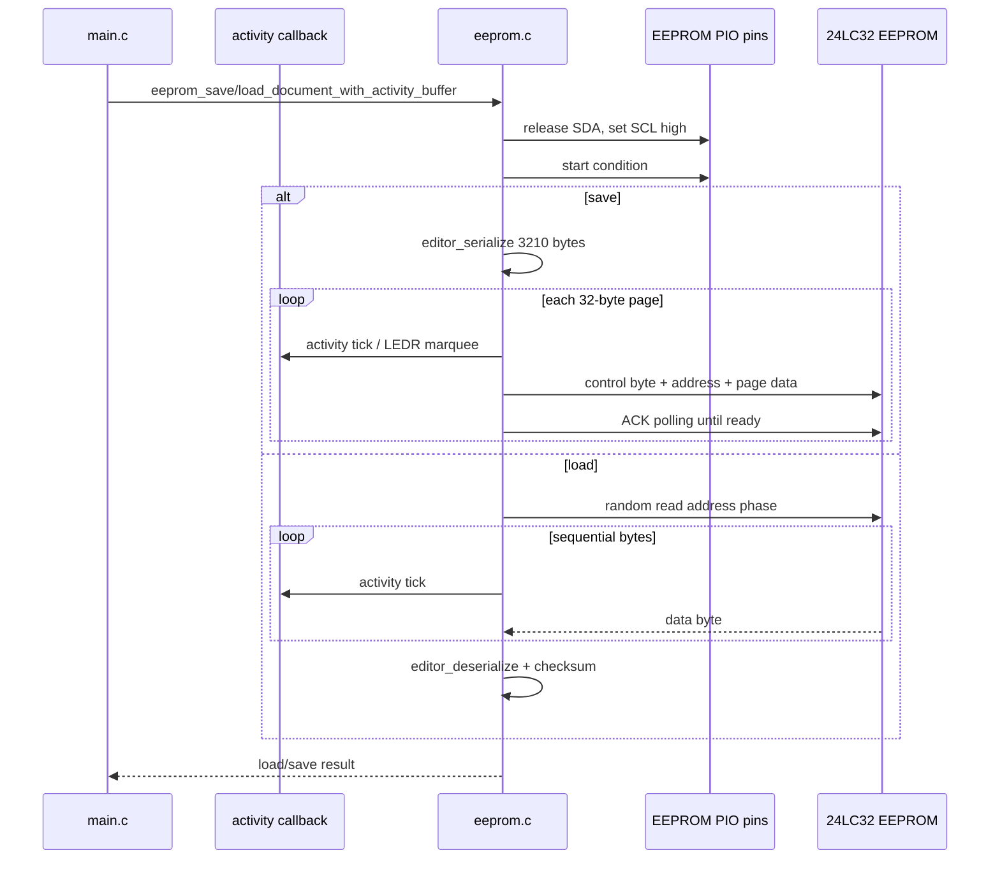

儲存時，`editor_serialize()` 會先把 `EditorDocument` 轉成固定 3210-byte layout。接著 `eeprom.c` 以 32-byte page 為單位寫入，並確保不跨 page boundary。每寫完一頁後，EEPROM 需要時間把資料真正寫進非揮發性記憶體，因此程式會使用 ACK polling，直到 EEPROM 再次回 ACK，才進行下一頁。

讀取時，程式先送出目標記憶體位址，再進入 sequential read，把整份 3210-byte layout 讀回 RAM。讀完後不會直接相信資料，而是交給 `editor_deserialize()` 檢查 magic、version、checksum、行數與游標範圍。這可以避免 EEPROM 尚未初始化、資料毀損或 layout 版本不合時，editor 載入錯誤內容。

---

## 12. Typing game 流程

Typing game 是建立在既有 editor、SD card、display framework 之上的展示功能。它不是重新寫一套輸入與顯示，而是重用 `EditorDocument` 作為單行輸入 buffer，重用 `editor_input.c` 處理 SW/KEY/PS2 input，重用 `sdcard.c` 讀取 `QUESTION.TXT`，再用 `display_show_typing_game()` 顯示題目、輸入、時間與進度。

Typing game 是明確的遊戲狀態轉移，因此使用 `stateDiagram-v2`。

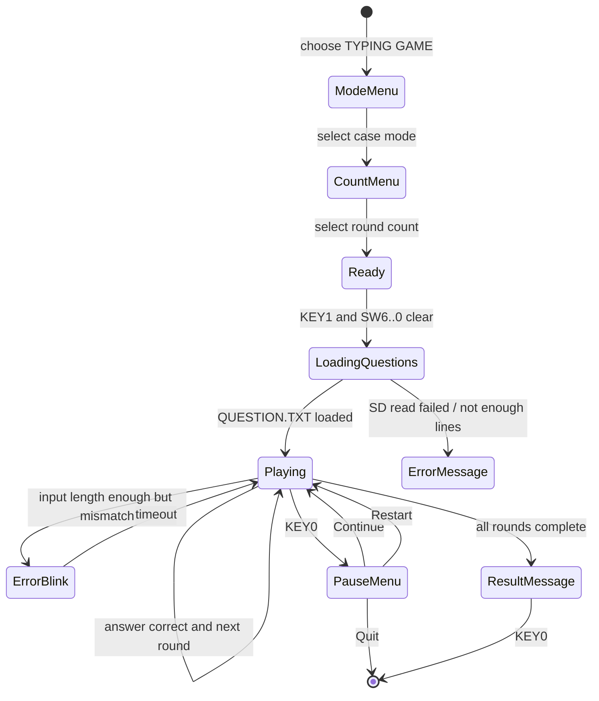

題目來源是 SD card 的 `QUESTION.TXT`。程式會讀取非空行，依使用者選擇的題數抽出題目，最多支援 50 題。大小寫模式包含 `Capitalized`、`Default`、`Random Caps`，因此同一份題庫可以產生不同難度或不同形式的練習。

輸入沿用 `editor_input.c`，但 `allow_newline = 0`，因此 Enter 不會在 typing game 中換行。秒表使用 Qsys timer 的 `alt_nticks()`，第一次 SW 變化或實際輸入時啟動。當輸入內容與題目完全相同時，進入下一題；若輸入長度已經足夠但內容錯誤，會觸發短暫錯誤提示。完成全部題目後，程式用總字數與時間計算 CPM，並透過 UI 顯示結果。

---

## 13. 維護與報告重點

報告可強調以下特色：

1. 硬體與軟體分工清楚：Verilog 處理 PS/2 timing 與 LEDR blocking animation，C 處理 UI、editor、SD/FAT、typing game。
2. 同一份 `EditorDocument` 被 EEPROM editor、SD editor、typing game input 重用，降低資料結構重複設計。
3. `display.c/.h` 是可重用 UI 畫面框架，將選單、閃爍字樣、loading 跑馬燈、modal message、editor viewport、typing game display 等畫面 pattern 提供給不同功能呼叫。
4. SD card 不是 raw sector demo，而是支援 FAT16/FAT32 root directory 讀寫固定短檔名，能從電腦建立文字檔，再由 FPGA 系統讀取。
5. blocking I/O 期間仍能由 Verilog LEDR controller 顯示 activity marquee，避免 C 等待 SD/EEPROM 時板子看起來像當機。
6. PS/2 keyboard 透過 FIFO 與 PIO handshake 接入 Nios，保留 SW/KEY 測試輸入，也支援較自然的鍵盤打字。

後續修改提醒：Qsys 改動後一定要更新 BSP；LEDR flag bit 若改動，需同步更新 `display.h`、`ledr_flag_controller.v`、`docs/ledr_flag.md`；新增 UI 畫面時優先擴充 `display.c/.h`；新增選單時優先使用 `menu.c/.h`；SD card 目前不支援長檔名、子目錄與 exFAT；EEPROM layout 若改版，應調整 version 或加入相容讀取。
